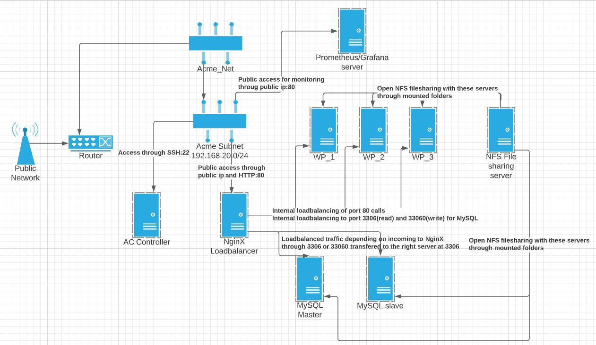

Linnaeus University

Faculty of Technology – Department of Computer Science

**2DV517 - Deployment Infrastructures**

**Examination 2**

**Students:**

Tomas Marx-Raacz von Hidvég (tendn09)

Susanna Persson (sp222xw)

Dennis Demir (dd222gc)  
Julia Perlkvist (jp223es)

**Group: 6**

INTRODUCTION
============

This document aims to record the planning and execution of the course 2dv517
group project. It will record how the plan was devised, how it changed and why.
It will also record in which way the work was done and divided throughout the
allotted time schedule for the project.

Furthermore, within this document we will also include references to theoretical
works regarding patterns that we followed, both by accident and by design.

The repository for the project can be found on the following address:

<https://github.com/DennisDemir24/2DV517-assignment2>

And the Video presentation of the setup can be found on the following address:

1.  THE OVERVIEW

    1.  The initial planning

Now after having the initial meeting with the group, it became apparent that
none of us had experience with working with any of the automation tools, except
Kubernetes which is rather a tool for dividing an infrastructure into
containers.

Spurred by a statement in an instructional video in the course 1dv032 minted by
the faculty prefect Morgan Ericsson that you could do all pieces of the puzzle
with Ansible, the decision was taken to explore if this assignment could be
undertaken wholly through Ansible.

As for the general structure of the setup the choice was taken to go for a
traditional VM setup instead of a container setup through Kubernetes due to the
limited prior experience the group had of automation tools. This decision was to
lower the risk of the task becoming too overwhelming. The setup was divided into
a network, subnet and router followed by eight virtual machines as seen in Table
1.

*Table 1 . Basic setup*

| VM                                       | Amount |
|------------------------------------------|--------|
| Wordpress hosts servers                  | 3      |
| MySQL servers                            | 2      |
| NFS file sharing server                  | 1      |
| NginX internal and external loadbalancer | 1      |
| Prometheus/Grafana monitoring server     | 1      |

A repository and project board were set up on GitHub by one of the group members
and shared with the rest of the participants in this project.

As far as workflow was concerned the group agreed on working only with the
master branch and having clear communication regarding uploads to said
repository in a separate Discord channel that was set up for this groups work
during the course.

Weekly meetings was planned, initially during Wednesday but after two weeks
moved to Monday to recap what had been done properly until the sprint review
taking place on Tuesdays.

Exploratory work and preparation
--------------------------------

The participants started off the project by familiarizing themselves with the
tools and the contents of the website as it existed in its current state. For
this, half of the group attempted to set up the old version of the website to
gain an understanding of its different components and the steps involved in the
setup, while the other half of the group began studying Ansible.

Since none of the group members had prior experience with Ansible aside from
reading about it in a prior assignment, the decision was taken that some group
members would start learning the tool basics while others studied the
infrastructure so that we then could share our new knowledge with each other and
combine our understanding of the website with knowledge about how to automate
the setup.

Of course, manual setup is a good first step to take before automating to figure
out the steps involved and ensure that they work as intended. A bash script
([link](https://github.com/DennisDemir24/2DV517-assignment2/blob/main/bash_scripts/lamp_install_with_backup.sh))
was created for the initial setup of the old version of the website which gave
some idea of what to do as a basis for then expanding and creating the new
infrastructure and automating it.

However, this script failed to run the site properly and as to why was
discovered much later which will be covered later.

Workflow - trial, error and progress
------------------------------------

Our initial plan had been to rely on Ansible for automation as it seemed to be
capable of achieving everything we needed. Although decent progress with Ansible
was made, The work grinded slightly to a halt with the provisioning through
Ansible due to some weaknesses in the modules for OpenStack provisioning. The
decision was taken to lay aside Ansible as a provisioning tool for this
assignment and explore Terraform as a tool for provisioning instead([old files
from initial
attempt](https://github.com/DennisDemir24/2DV517-assignment2/tree/main/Ansible/unused_files)).
The provisioning through Terraform worked a lot better and the planned setup was
quickly devised ([Terraform
folder](https://github.com/DennisDemir24/2DV517-assignment2/tree/main/Terraform)).
Ansible was left to configure the servers from an inventory file created through
the Terraform provisioning ([Ansible
folder](https://github.com/DennisDemir24/2DV517-assignment2/tree/main/Ansible)).

A decision at this point was taken to use a combination of dynamic configuration
and hardcoded configuration through pre-created configuration files for various
packages that would run on the virtual machines. This was achieved through
pre-determining the internal IP addresses of the VM’s through Terraform. This
made it possible to construct for example template configuration files for NginX
load balancing, both internal (for MySQL read and write separation) as well as
easy setup of a configuration for the routing of calls from the public web
towards the WordPress
servers([config](https://github.com/DennisDemir24/2DV517-assignment2/tree/main/Ansible/templates)).

Initially the intention was to use a bastion jump-host (The NginX server) as a
point of entry to the network and to run both Ansible and Terraform from remote
machines. However, we struggled with making this work properly, and eventually
decided to drop the idea before pouring too much time and effort into it that
might be better used elsewhere. Instead, a separate AC controller machine was
constructed through Terraform, bringing the total of machines up to nine and
finalizing the setup as can be seen in Figure 1.

*Figure 1. General setup of machines through Terraform.*

A Bash script was created to transport the Ansible folder and various template
files and backup files to the Ansible Controller machine so one, after accessing
it through SSH could run the rest of the configuration process([Bash
script](https://github.com/DennisDemir24/2DV517-assignment2/blob/main/Ansible/upload.sh)).

After making some progress with Ansible and Terraform we started to consider the
monitoring aspect. For this we decided that we were going to use Prometheus
([Prometheus](https://github.com/DennisDemir24/2DV517-assignment2/tree/main/Ansible/roles/prometheus)),
and we also decided to use Grafana
([Grafana](https://github.com/DennisDemir24/2DV517-assignment2/tree/main/Ansible/roles/grafana))
alongside it to present the data from Prometheus. None of the group members had
any real experience with said applications but it had been briefly run through
in a previous course and as such it became an obvious choice.

When researching the Prometheus/Grafana bundle the Node Exporter
tool(NodeExporter) was also included into the mix to act as a metric collector
of machine metrics for Prometheus.

1.  SPECIFIC AUTOMATION TOOLS AND WHAT PARTS THEY PLAY

    1.  Bash scripts

Bash scripts, being a very early take on automation still plays a part in this
project. In this case it was the ad-hoc solution to the otherwise dreary process
of moving everything needed for Ansible to the ansible controller VM. What it
does is loop through the files in the Ansible directory and send everything that
is not marked “.secret” to the Ansible VM.

Terraform
---------

Terraform was used for what it was supposed to, to provision the OpenStack VMs,
network, subnet, router, and security group as well as assigning said security
groups to the individual servers through the module for this cloud.

Furthermore, the provisioning was configurated to create an inventory file for
Ansible to use for the configuration of the individual servers as well as the
ansible.cfg to replicate some parameters that the individual administrator needs
to input into a terraform.tfvars file.

Other configurations files were also created and put into the Ansible folder
this way including various vars files so that an administrator would have to
change as little as possible.

Some preinstallations of needed packages was made through including cloud-init
([cloud-init](https://github.com/DennisDemir24/2DV517-assignment2/tree/main/cloud_init_ansible))
scripts with the terraforming, especially for the Ansible controller that had
various dependencies to be able to run both Ansible and some of its modules
necessary for this project. Other general cloud-init scripts was also added into
the mix for databases and the rest of the machines to preinstall some
dependencies as well as updating and upgrading packages during spawning instead
of doing it during configuration. This last effort was done so that the ansible
configurations wouldn´t take so long to finish once they ran the same checks for
updates.

Ansible
-------

Now Ansible is the real workhorse in this project, and by far the one that
needed the most research. Using a combination of dynamically created variables
from terraform as well as, as mentioned previously, pre-constructed conf files
of some variables that will never change, for example private network IP
addresses of hosts, these playbooks were designed to configure everything that
was needed to have the services running on the VMs.

### NginX Load balancer

The NginX load balancer was created through installing dependencies, utilizing
pre-constructed .conf files and placing them in the right locations as well as
starting the service. This was made possible by prior legwork done in terraform
with the fixed IP addresses internally. As NginX only deals with this type of
proxy commands it was a decently easy task to setup the HTTP load balancing
towards WordPress servers as well as the internal TCP stream of the
communication between the WordPress servers and the MySQL servers (port 33060
was pointed towards the master, 3306 divided between master and slave).

### NFS File sharing

This was our interpretation of a location where administrators could upload
files. This was a very straight forward installation of needed dependencies as
well as inclusion of a preconfigured exports file that tells the program which
IPs and what permissions said IPs would have towards the shared folders. The
NFS-commons package also needed to be installed on all servers needed to access
said files or in any way needed persistent storage for backups (MySQL and
WordPress servers) as well as directories mounted that.

In its current form administrators can not upload to it, but the filesharing is
done. However, the infrastructure could for example be expanded with an FTP
server on this specific VM with proxy through the NginX that was presented in
section 3.3.1.

### MySQL Master/Slave setup

Patterns
========

Immutable server
----------------

Immutable server, as described by Kief Morris [1], is where a server’s
configuration is never changed, but rather new versions are created to replace
old versions. This avoids potential risks of changing running servers, while
also allowing you to make sure that the new server works as intended before
removing the previous version. This pattern requires strong automation. 

It has been a goal throughout the project to work towards absolute automation, although we have not succeeded. Our original vision was one command to build the entire infrastrucutre and deploy the site with all accessory features such as databases and file server. We have consistently worked with automating everything that we do in a way that enables us to tear down and rebuild the latest configuration at any time. We have built scripts from the start, starting with bash scripts for  such minimal tasks as uploading the Ansible playbooks automatically and registering the ssh keys on the Ansible Control server.

Push server configuration
-------------------------

Push server configuration, as described by Morris [1], 

Bibliography
============

[1] K. Morris, *Infrastructure as Code*, 2nd ed. O'Reilly Media, Inc. 2020.

[2] ...

[X] <https://github.com/prometheus/node_exporter>

[X] <https://grafana.com/>

[X] https://prometheus.io/
